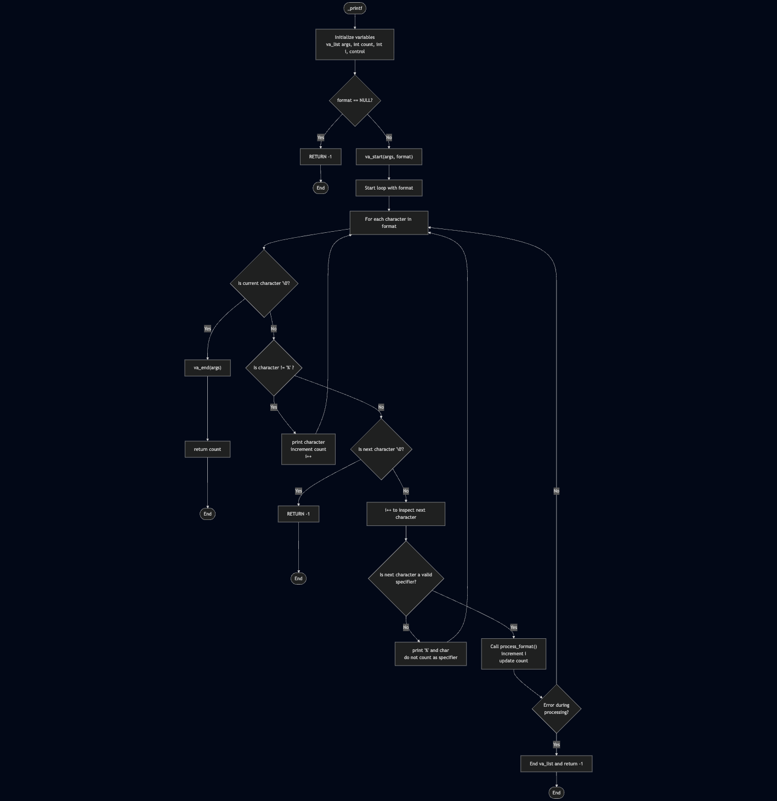

# Our flowchart:


# _printf:

A custom implementation of the C standard library function printf().

## Description:

This project is a recreation of the printf() function from the C standard library. The function produces output according to a format string and variable arguments, writing output to stdout (the standard output stream).

## Function Prototype:
```c
int _printf(const char *format, ...);
```

Supported Conversion Specifiers:

- `%c` = prints a single character  
- `%s` = prints a string of characters  
- `%d` = prints a signed decimal integer  
- `%i` = prints a signed integer  
- `%%` = prints a percent sign  

All files will be compiled on Ubuntu 20.04 LTS using gcc with the options:  
`-Wall -Werror -Wextra -pedantic -std=gnu89`

All files should end with a new line.  
Code should use the Betty style.  
No more than 5 functions per file.  
All header files should be include guarded.  
Global variables are not allowed.

---

## ✅ Additional Requirements (added)

- Project must compile without warnings or errors  
- `_printf` must return the **number of printed characters**  
- If `format == NULL`, `_printf` must return `-1`  
- If `%` is the last character (e.g. `"Hello %"`), return `-1`  
- Unsupported specifiers print literally:  
  `%y` → `%y`  

---

## Compilation

```bash
gcc -Wall -Werror -Wextra -pedantic -std=gnu89 *.c -o printf
```

## Usage:

Include the header file in your C program:

```c
#include "main.h"
```

### Example usage:

```c
#include "main.h"

int main(void)
{
    _printf("Hello, %s!\n", "World");
    _printf("Character: %c\n", 'A');
    _printf("Number: %d\n", 42);
    _printf("Percentage: %%\n");
    
    return (0);
}
```

## Output:

```
Hello, World!
Character: A
Number: 42
Percentage: %
```

---

## Files:

main.h — Header file containing function prototypes and includes  
_printf.c — main printf function implementation  
_putchar.c — function that prints a character  
man_3_printf.8 — man page for _printf
handle_format.c: processes format specifiers  

---

## 🧪 Testing (added):

To test the function, compile with your test files:

```bash
gcc -Wall -Werror -Wextra -pedantic -std=gnu89 *.c -o reworkedprintf
./reworkedprintf
```

---

## 📘 Man Page:

To view the man page:

```bash
man ./man_3_printf.8
```

or:

```bash
groff -Tascii -man man_3_printf.8
```

---

## ⚠️ Limitations (added):

- No support for:
  - width (`%10d`)
  - precision (`%.3s`)
  - flags (`+`, `-`, `0`, space, `#`)
  - length modifiers (`l`, `h`)
  - unsigned specifiers (`u`, `o`, `x`, `X`)
  - floating-point (`%f`, `%e`)
  - pointers (`%p`)
- No buffer handling  
- No advanced formatting  

This `_printf` is a **minimal educational version**, not a full POSIX printf.

---

## Authors:

Kevin Rigal — https://github.com/splint314  
Lucas Lupon — https://github.com/nobulp  

This project is part of the Holberton School curriculum.